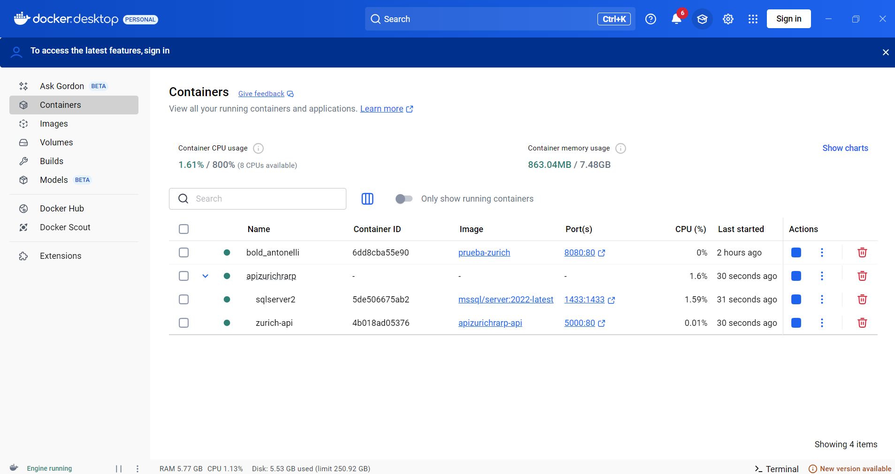

# Zurich RARP - Guía Completa de Instalación y Ejecución

## Descripción

Este proyecto es una API RESTful desarrollada en .NET 8 para la gestión de clientes y pólizas de seguros. Utiliza SQL Server como base de datos y está completamente dockerizado para facilitar su despliegue y pruebas locales.

---

## Tecnologías Utilizadas

- **.NET 8** (API Backend)
- **SQL Server 2022** (Base de datos)
- **Docker** y **Docker Compose** (Contenedores y orquestación)
- **Entity Framework Core** (ORM)
- **xUnit** (Pruebas unitarias)
- **AutoMapper** (Mapeo de modelos)
- **Microsoft.Data.SqlClient** (Conexión a SQL Server)

---

## Requisitos Previos

- [Docker Desktop](https://www.docker.com/products/docker-desktop/) instalado y corriendo.
- [Git](https://git-scm.com/) para clonar el repositorio (opcional).
- (Opcional) [Azure Data Studio](https://learn.microsoft.com/sql/azure-data-studio/download-azure-data-studio) o [SQL Server Management Studio](https://aka.ms/ssms) para explorar la base de datos.

---

## Clonar el Repositorio

```sh
git clone https://github.com/linelsk/prueba-tecnica-zurich-back.git
cd api.zurich.rarp
```

---

## Estructura del Proyecto

```text
.
├── api.zurich.rarp/           # Proyecto principal de la API (.NET 8)
├── biz.zurich.rarp/           # Lógica de negocio
├── dal.zurich.rarp/           # Acceso a datos y contexto EF Core
├── tests.zurich.rarp/         # Pruebas unitarias
├── .dockerignore              # Archivos y carpetas ignorados por Docker
├── add_roles.sql              # Script para popular la tabla Roles
├── api.zurich.rarp.sln        # Solución principal de Visual Studio
├── docker-compose.yml         # Orquestación de contenedores
├── README.md                  # Este archivo
└── script_creacion_bd.sql     # Script para crear la base de datos y tablas
```

---

## Construcción y Ejecución del Proyecto

### 1. Construir y levantar los contenedores

Desde la raíz del proyecto (donde está el `docker-compose.yml`):

```sh
docker-compose up --build
```

Esto descargará las imágenes necesarias, construirá la imagen de la API y levantará los contenedores de la API y SQL Server.

- La API estará disponible en: [http://localhost:5000/swagger](http://localhost:5000/swagger)
- SQL Server estará escuchando en el puerto 1433.

### 2. Verificar que los contenedores están corriendo

```sh
docker ps
```

Debes ver dos contenedores: `sqlserver2` y `zurich-api`.

---

## Creación y Poblado de la Base de Datos

### 1. Crear la base de datos y las tablas

Utiliza el archivo llamado `script_creacion_bd.sql` que se encuentra en la raíz del proyecto con el siguiente contenido:

```sql
USE [master]
GO

IF EXISTS (SELECT name FROM sys.databases WHERE name = N'ZurichRarp')
    DROP DATABASE [ZurichRarp];
GO

CREATE DATABASE [ZurichRarp];
GO

ALTER DATABASE [ZurichRarp] SET COMPATIBILITY_LEVEL = 160
GO

USE [ZurichRarp]
GO

-- Tabla Roles
CREATE TABLE [dbo].[Roles](
    [Id] [int] IDENTITY(1,1) NOT NULL,
    [Nombre] [nvarchar](50) NOT NULL,
    CONSTRAINT [PK_Roles] PRIMARY KEY CLUSTERED ([Id] ASC),
    CONSTRAINT [UQ_Roles_Nombre] UNIQUE NONCLUSTERED ([Nombre] ASC)
)
GO

-- Tabla Usuarios
CREATE TABLE [dbo].[Usuarios](
    [Id] [int] IDENTITY(1,1) NOT NULL,
    [NumeroIdentificacion] [char](10) NOT NULL,
    [NombreCompleto] [nvarchar](100) NOT NULL,
    [CorreoElectronico] [nvarchar](100) NOT NULL,
    [Telefono] [nvarchar](20) NOT NULL,
    [Direccion] [nvarchar](200) NULL,
    [RolId] [int] NOT NULL,
    [contrasena] [nchar](10) NULL,
    CONSTRAINT [PK_Usuarios] PRIMARY KEY CLUSTERED ([Id] ASC),
    CONSTRAINT [UQ_Usuarios_NumeroIdentificacion] UNIQUE NONCLUSTERED ([NumeroIdentificacion] ASC)
)
GO

-- Tabla Polizas
CREATE TABLE [dbo].[Polizas](
    [Id] [int] IDENTITY(1,1) NOT NULL,
    [ClienteId] [int] NOT NULL,
    [TipoPoliza] [nvarchar](20) NOT NULL,
    [FechaInicio] [date] NOT NULL,
    [FechaExpiracion] [date] NOT NULL,
    [MontoAsegurado] [decimal](18, 2) NOT NULL,
    [Estado] [nvarchar](10) NOT NULL,
    CONSTRAINT [PK_Polizas] PRIMARY KEY CLUSTERED ([Id] ASC)
)
GO

-- Relaciones
ALTER TABLE [dbo].[Usuarios]  WITH CHECK ADD  CONSTRAINT [FK_Usuarios_RolId] FOREIGN KEY([RolId])
REFERENCES [dbo].[Roles] ([Id])
GO

ALTER TABLE [dbo].[Polizas]  WITH CHECK ADD  CONSTRAINT [FK_Polizas_ClienteId] FOREIGN KEY([ClienteId])
REFERENCES [dbo].[Usuarios] ([Id])
GO
```

### 2. Ejecutar el script de creación

Ejecuta el siguiente comando en power Shell de windows desde la raíz del proyecto (ajusta la red si es necesario):

```sh
docker run -it --rm -v ${PWD}:/sql --network=apizurichrarp_zurich-network mcr.microsoft.com/mssql-tools /opt/mssql-tools/bin/sqlcmd -S sqlserver2 -U sa -P 'Your_password123!' -i /sql/script_creacion_bd.sql
```

### 3. Popular la tabla Roles

Utiliza el archivo llamado `add_roles.sql` que se encuentra en la raiz del proyecto con el siguiente contenido:

```sql
USE ZurichRarp;
GO
DBCC CHECKIDENT ('Roles', RESEED, 0);
SET IDENTITY_INSERT Roles ON;
INSERT INTO Roles (Id, Nombre) VALUES (1, 'Administrador');
INSERT INTO Roles (Id, Nombre) VALUES (2, 'Cliente');
SET IDENTITY_INSERT Roles OFF;
GO
```

Ejecuta este comando en power Shell de windows:

```sh
docker run -it --rm -v ${PWD}:/sql --network=apizurichrarp_zurich-network mcr.microsoft.com/mssql-tools /opt/mssql-tools/bin/sqlcmd -S sqlserver2 -U sa -P 'Your_password123!' -i /sql/populate_roles.sql
```

---

## Probar la API

- Accede a [http://localhost:5000/swagger](http://localhost:5000/swagger) para ver la documentación interactiva de la API (si está habilitada).
- Puedes usar herramientas como [Postman](https://www.postman.com/) para probar los endpoints.

---

## Pruebas Unitarias

Para ejecutar las pruebas unitarias (requiere .NET 8 SDK):

```sh
dotnet test
```

---

## Notas y Consejos

- Si necesitas reiniciar todo desde cero, ejecuta:

```sh
docker-compose down --volumes --remove-orphans
```

- Si tienes problemas de conexión, asegúrate de que los contenedores estén en la misma red y que SQL Server esté listo antes de ejecutar los scripts.
- Puedes explorar la base de datos usando Azure Data Studio o SQL Server Management Studio conectándote a `localhost,1433` con usuario `sa` y contraseña `Your_password123!`.

---

## Imágenes de Referencia




---

## Contacto y Soporte

Si tienes dudas o problemas, por favor abre un issue en el repositorio o contacta al responsable del proyecto.

Rodrigo Alberto Rodriguez Peralta, rodrigo.stps@gmail.com
